# HW1 实验报告

## 1. 代码结构

| 模块 | 文件 | 作用 |
|---|---|---|
| 数据加载与预处理 | `data_loader.py` | 读取 EuroSAT、归一化、展平、数据增强、数据集划分 |
| 模型定义 | `model.py` | 三层 MLP、ReLU/Sigmoid/Tanh、Softmax、交叉熵、反向传播 |
| 优化器 | `optimizer.py` | SGD 与 Step Learning Rate Scheduler |
| 训练循环 | `train.py` | 训练、验证、最优模型保存、历史记录 |
| 测试评估 | `test.py` | 测试集准确率、混淆矩阵、分类别准确率、错分样本导出 |
| 超参数查找 | `search.py` | Grid Search 与 Random Search |
| 可视化 | `visualize.py` | 训练曲线、混淆矩阵、第一层权重、错例可视化 |


## 2. 数据集与预处理

### 2.1 数据集简介

EuroSAT RGB 数据集共包含 **27,000** 张遥感图像，分为 10 个类别。各类别样本数如下：

| 类别 | 数量 |
|---|---:|
| AnnualCrop | 3000 |
| Forest | 3000 |
| HerbaceousVegetation | 3000 |
| Highway | 2500 |
| Industrial | 2500 |
| Pasture | 2000 |
| PermanentCrop | 2500 |
| Residential | 3000 |
| River | 2500 |
| SeaLake | 3000 |

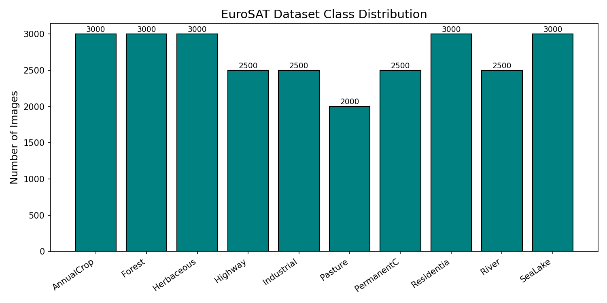

*图 1  EuroSAT 数据集各类别样本数分布。整体相对均衡，但 Pasture 明显更少。*

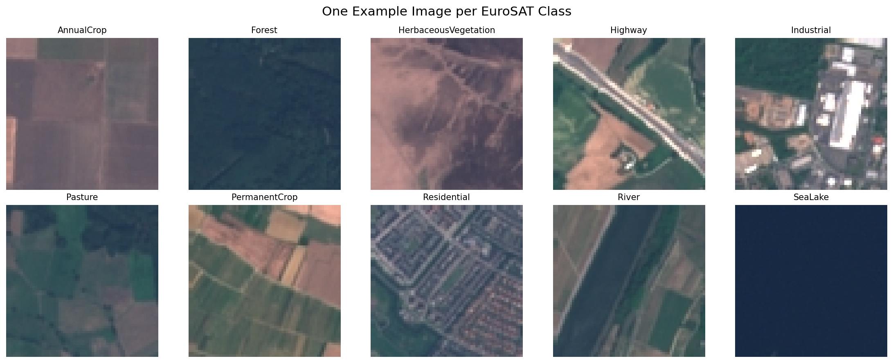

*图 2  每个类别各选取 1 张样本。可以看出多类之间存在明显视觉相似性，例如 Highway 与 River 都可能表现为细长结构，HerbaceousVegetation 与 PermanentCrop 都呈现大片植被纹理。*

### 2.2 数据预处理与划分

在 `data_loader.py` 中，数据处理流程如下：

1. 将原始图像统一为 `64 x 64 x 3`
2. 将像素值缩放到 `[0, 1]`
3. 使用训练集均值和标准差做标准化
4. 将图像展平为一维向量，输入维度为 `64 x 64 x 3 = 12288`
5. 按随机种子 `42` 划分训练集、验证集、测试集

本次实验的实际划分规模为：

| 划分 | 样本数 | 比例 |
|---|---:|---:|
| Train | 18900 | 70% |
| Val | 4050 | 15% |
| Test | 4050 | 15% |

由于代码采用的是**随机划分而非分层划分**，所以每个类别在三个子集里的数量会有小幅波动，但总体仍较稳定。

### 2.3 数据增强

训练阶段启用了数据增强，增强策略定义在 `augment_batch()` 中，包括：

- 水平翻转，概率 `0.5`
- 垂直翻转，概率 `0.5`
- 90/180/270 度旋转，概率 `0.5`
- 亮度扰动，`brightness_std = 0.1`

对于遥感图像分类，这类增强是合理的，因为地物类别往往不依赖于绝对朝向，适度的颜色扰动也能提升模型鲁棒性。

## 3. 模型设计

### 3.1 三层 MLP 结构

本实验使用的是一个三层全连接网络：

- 输入层：`12288`
- 第一隐藏层：`512`
- 第二隐藏层：`256`
- 输出层：`10`

前向传播可表示为：

- `Z1 = XW1 + b1`
- `A1 = activation(Z1)`
- `Z2 = A1W2 + b2`
- `A2 = activation(Z2)`
- `Z3 = A2W3 + b3`
- `P = softmax(Z3)`

反向传播中，输出层梯度由交叉熵损失直接得到，再逐层链式回传到 `W3 / W2 / W1` 与对应偏置。`model.py` 中同时实现了：

- `ReLU`
- `Sigmoid`
- `Tanh`

最终实验主模型使用 `ReLU`，原因是它在搜索阶段整体更稳定，并且收敛速度明显快于 `Tanh`。

### 3.2 优化与正则化

训练时使用：

- 优化器：SGD
- 学习率策略：Step LR
- 损失函数：Cross-Entropy Loss
- 正则化：L2 Weight Decay
- 梯度裁剪：`grad_clip = 5.0`

最终训练配置如下：

| 超参数 | 取值 |
|---|---:|
| Hidden1 | 512 |
| Hidden2 | 256 |
| Activation | ReLU |
| Initial LR | 0.005 |
| Weight Decay | 1e-4 |
| Batch Size | 128 |
| Epochs | 50 |
| LR Step Size | 15 |
| LR Gamma | 0.5 |
| Seed | 42 |
| Augment | True |

## 4. 超参数搜索

### 4.1 Grid Search

网格搜索搜索空间为：

- 学习率：`[0.01, 0.005, 0.001]`
- 隐层宽度：`[128, 256, 512]`
- Weight Decay：`[0, 1e-4, 1e-3]`

每组配置训练 20 个 epoch，并记录验证集最佳准确率。结果表明：

- **学习率过低（0.001）明显欠拟合**
- **更大的隐藏层通常效果更好**
- 在 20 epoch 的短训练下，`lr=0.01` 的表现优于 `0.005`

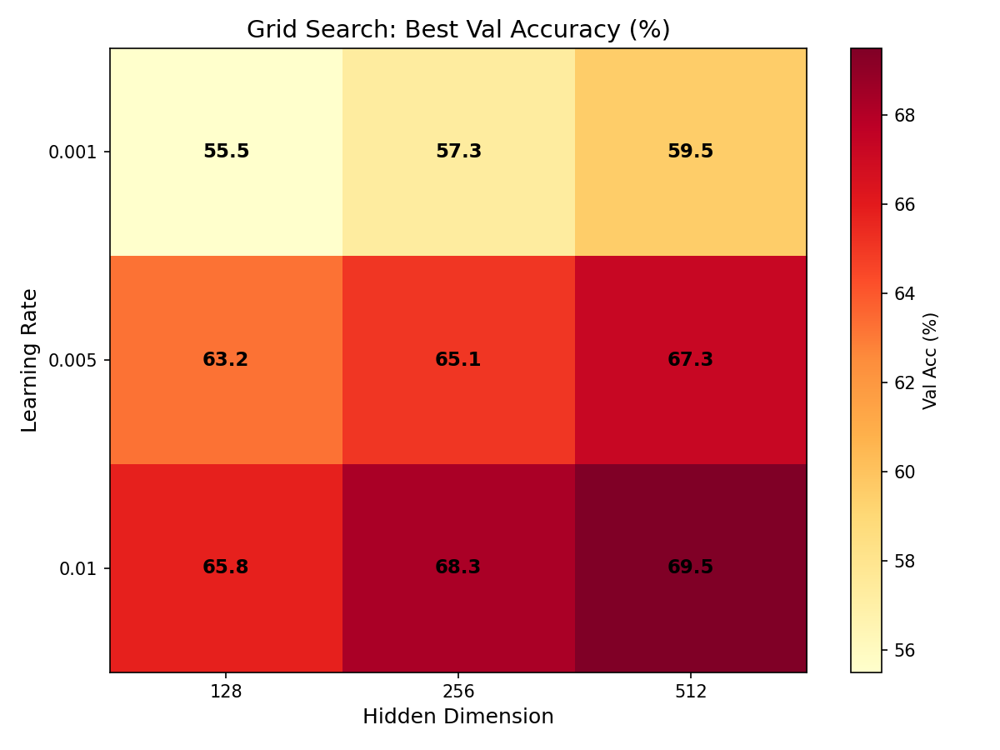

*图 3  Grid Search 的主趋势非常清晰：学习率越高、隐藏层越宽，验证集表现越好。*

Grid Search 最优配置为：

| lr | hidden1 | hidden2 | weight_decay | best val acc |
|---:|---:|---:|---:|---:|
| 0.01 | 512 | 256 | 0.001 | 69.51% |

### 4.2 Random Search

随机搜索共进行了 20 次试验，范围覆盖不同学习率、隐藏层规模、正则强度与激活函数。这里同时展示 Top-5 结果与整体分布。

Top-5 配置如下：

| rank | lr | hidden1 | hidden2 | activation | weight_decay | best val acc |
|---:|---:|---:|---:|---|---:|---:|
| 1 | 0.0280 | 512 | 512 | ReLU | 1.27e-5 | 70.12% |
| 2 | 0.0079 | 512 | 64 | ReLU | 6.99e-3 | 68.05% |
| 3 | 0.0050 | 1024 | 256 | ReLU | 5.26e-4 | 67.58% |
| 4 | 0.0308 | 64 | 512 | ReLU | 2.80e-4 | 66.35% |
| 5 | 0.0079 | 128 | 256 | ReLU | 2.51e-6 | 66.02% |

其中最优结果为：

| lr | hidden1 | hidden2 | activation | weight_decay | best val acc |
|---:|---:|---:|---|---:|---:|
| 0.0280 | 512 | 512 | ReLU | 1.27e-5 | 70.12% |

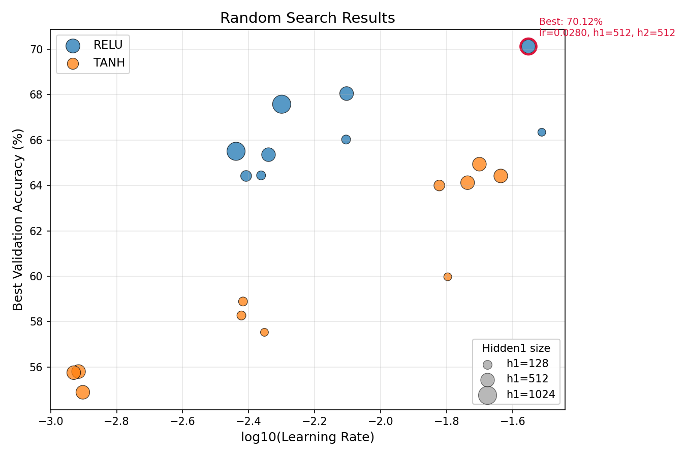

*图 4  随机搜索 20 次试验的整体分布。横轴为 `log10(lr)`，纵轴为最佳验证准确率，颜色区分激活函数，点大小表示第一隐藏层宽度。*

可以看出：

- `ReLU` 在 9 次试验中的平均最佳验证准确率为 **66.43%**，明显高于 `Tanh` 在 11 次试验中的 **59.87%**
- 所有 Top-5 配置全部使用 `ReLU`，说明对于当前任务和 20 epoch 的短周期训练，`ReLU` 更稳定
- 当 `lr >= 0.005` 时，平均最佳验证准确率为 **65.56%**；而 `lr < 0.005` 时仅为 **60.09%**，说明较高初始学习率更有利于快速收敛
- 较大的隐藏层通常更占优。最优配置采用 `512-512`，而 `hidden1 >= 512` 的试验整体上限也明显高于较小网络

注：随机搜索只有 20 次试验，因此这里更适合用于总结趋势，而不是把单次最优结果视为绝对最优解。

### 4.3 最终配置

最终正式训练使用的是 `512-256 + ReLU + lr=0.005 + weight_decay=1e-4`。它并不是 20 epoch 搜索中数值最高的一组，但它与搜索结论是一致的：

- 保留了“大隐藏层 + ReLU”这个最重要趋势
- 使用较保守的初始学习率，配合 50 epoch 和 Step LR，训练更稳定
- 最终在完整训练下得到 **70.32% 的最佳验证准确率**


## 5. 训练过程分析

训练历史保存在 `checkpoints_aug/history.json` 中。关键结果如下：

| 指标 | 数值 |
|---|---:|
| Best Val Accuracy | 70.32% |
| Best Epoch | 47 |
| Final Train Loss | 0.8061 |
| Final Val Loss | 0.9235 |
| Final Train Accuracy | 74.94% |
| Final Val Accuracy | 70.02% |

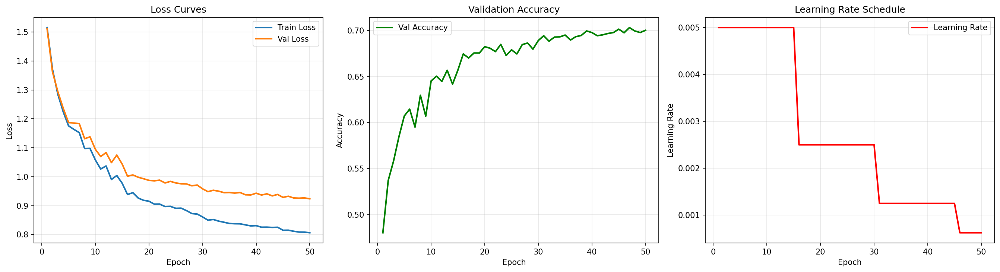

*图 5  训练集/验证集损失、验证准确率与学习率变化曲线。*

从曲线可以观察到：

1. 前 10 个 epoch 收敛最快，验证准确率由约 `48%` 快速提升到 `64%+`
2. 15、30、45 epoch 处学习率衰减后，验证准确率继续缓慢上升
3. 训练集损失始终低于验证集损失，但两者没有明显发散，说明**存在一定泛化差距，但不过度**
4. 最优验证准确率出现在第 47 个 epoch，之后性能基本趋于稳定

整体来看，该模型是**正常收敛、轻度欠拟合/容量受限**的状态，而不是严重过拟合。考虑到输入是直接展平的遥感图像，MLP 对局部空间结构的建模能力有限，这个现象是合理的。

## 6. 测试结果

在测试集上，最优模型的总体准确率为：

| 指标 | 数值 |
|---|---:|
| Test Accuracy | **70.17%** |
| Correct / Total | 2842 / 4050 |
| Misclassified | 1208 |

### 6.1 分类别准确率

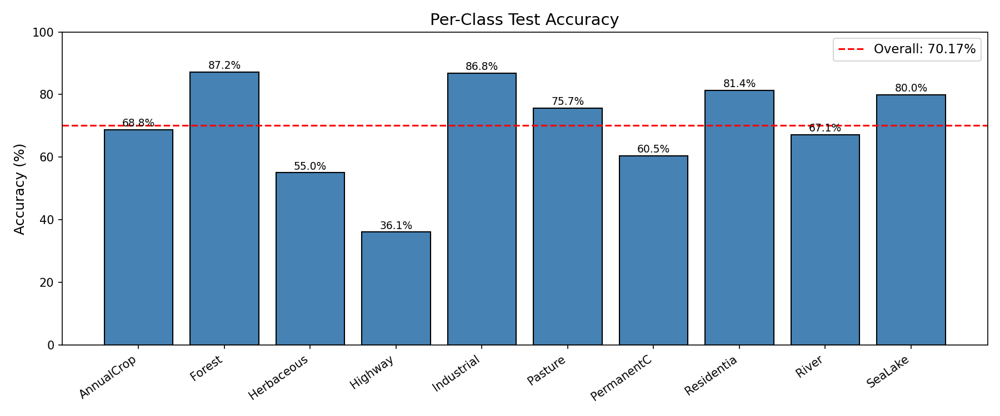

*图 6  各类别测试准确率。红虚线为整体测试准确率 70.17%。*

对应的分类别准确率如下：

| 类别 | Test Samples | Accuracy |
|---|---:|---:|
| AnnualCrop | 439 | 68.79% |
| Forest | 447 | 87.25% |
| HerbaceousVegetation | 436 | 55.05% |
| Highway | 374 | 36.10% |
| Industrial | 380 | 86.84% |
| Pasture | 268 | 75.75% |
| PermanentCrop | 382 | 60.47% |
| Residential | 430 | 81.40% |
| River | 420 | 67.14% |
| SeaLake | 474 | 79.96% |

结果显示：

- **Forest**、**Industrial**、**Residential** 的可分性较强
- **Highway** 是最难分类的类别，仅有 **36.10%**
- **HerbaceousVegetation** 与 **PermanentCrop** 也较难区分

### 6.2 混淆矩阵

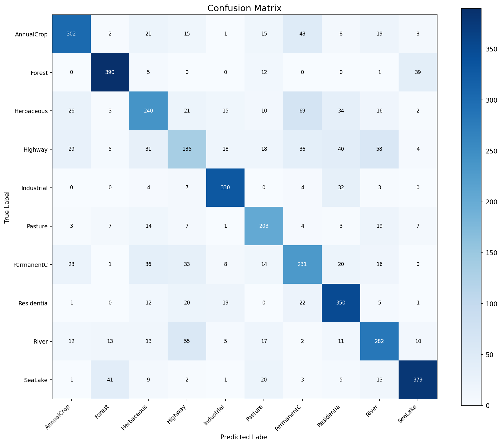

*图 7  测试集混淆矩阵。对角线越深表示该类越容易被正确识别。*

从混淆矩阵可以进一步看出，错误并不是随机分布的，而是集中出现在若干高度相似的类别对上。

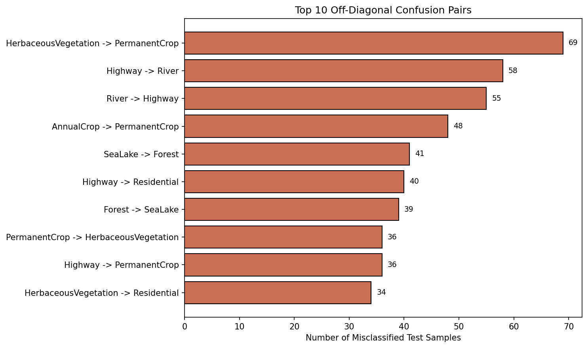

*图 8  测试集最主要的 10 组错分类别对。*

最主要的混淆对包括：

- HerbaceousVegetation -> PermanentCrop：69
- Highway -> River：58
- River -> Highway：55
- AnnualCrop -> PermanentCrop：48
- SeaLake -> Forest：41
- Highway -> Residential：40

这些结果说明模型主要依赖全局颜色和粗粒度纹理，而对局部几何结构和上下文关系的表达不足。

## 7. 第一层权重可视化与空间模式分析

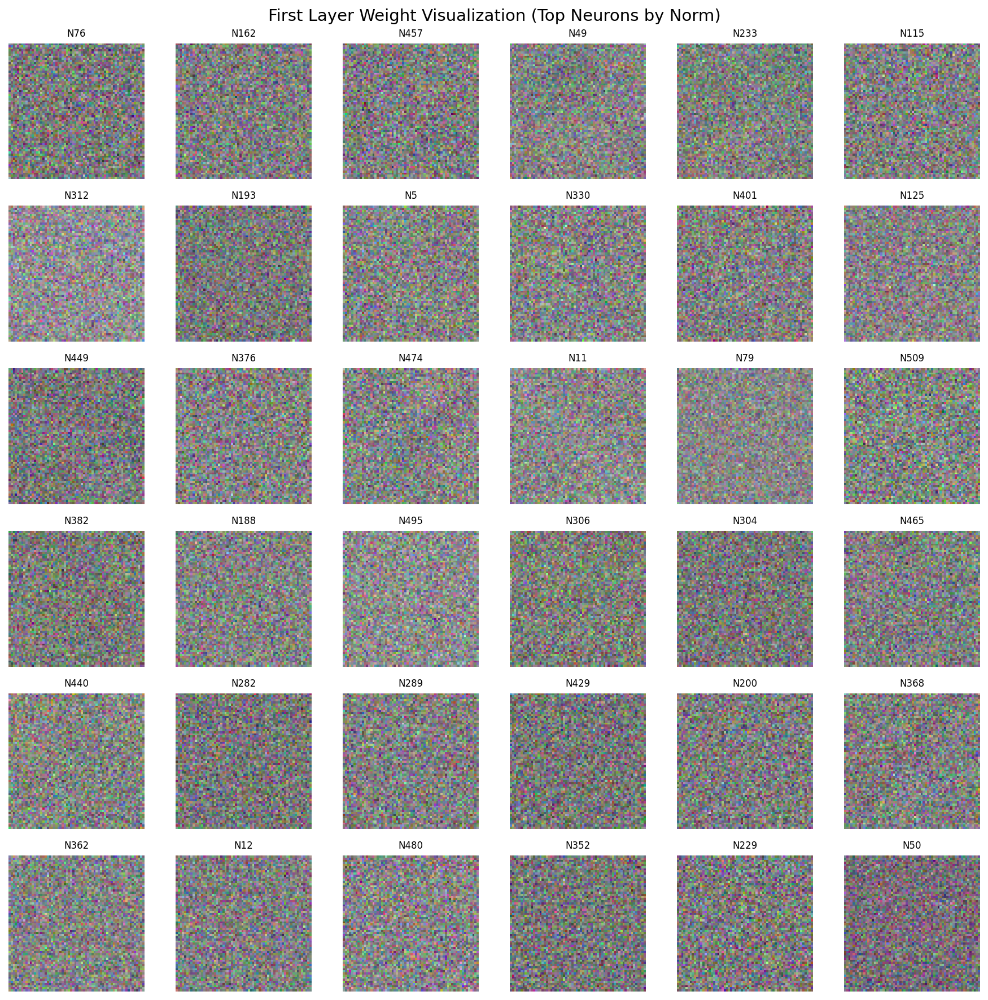

*图 9  第一层权重中范数较大的若干神经元，将其恢复为 `64 x 64 x 3` 图像后的结果。*

将第一层隐藏层权重恢复到了图像尺寸进行观察。与 CNN 中常见的边缘/角点/纹理模板不同，这些权重图整体呈现为：

- 高频噪声状纹理较多
- 少量神经元带有轻微的蓝绿色或棕绿色通道偏好
- 缺少清晰、可解释的空间结构模板

这与模型结构本身是吻合的。由于本实验采用的是**展平输入的全连接 MLP**，图像的局部邻域关系在输入阶段就被打散了，因此第一层权重更像是对全局像素组合的线性投影，而不是对“河流边缘”“森林纹理”这类局部空间模式的显式提取器。

因此，本实验中的权重可视化结论是：

- 模型确实学到了一些粗糙的颜色统计信息
- 但没有学到强可解释的空间纹理模板

## 8. 错例分析

### 8.1 随机错分样本

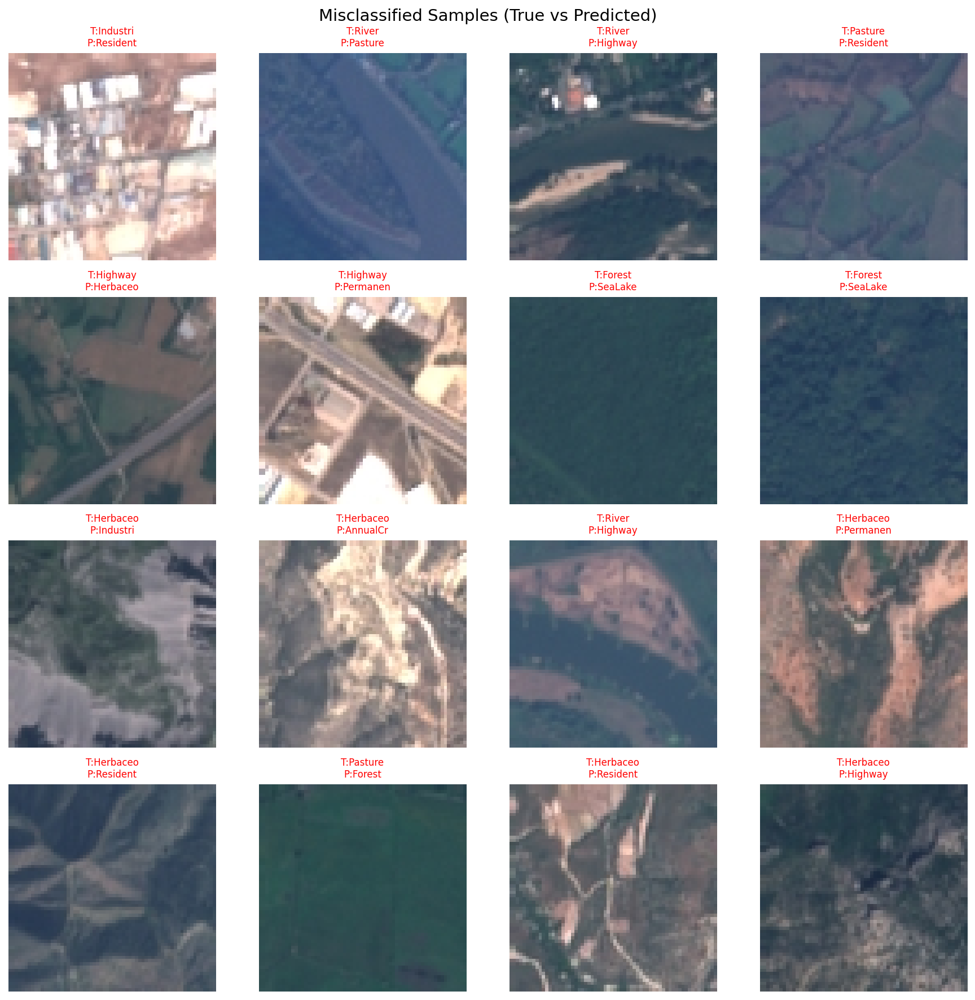

*图 10  测试集随机抽样的错分样本。标题中 `T` 为真实类别，`P` 为预测类别。*

### 8.2 典型混淆对示例

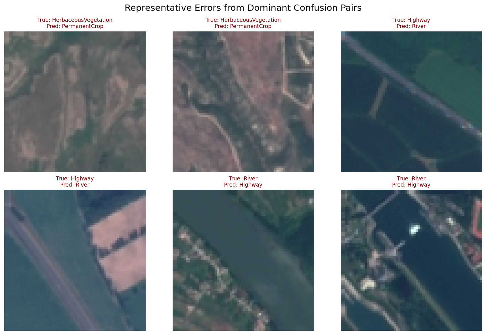

*图 11  从最主要的混淆对中选出的代表性错分样本。*

结合图 8 与图 11，可以得到如下分析：

#### （1）HerbaceousVegetation 与 PermanentCrop 易混淆

这两类都以大面积植被斑块为主，颜色上通常表现为绿色、黄绿色或棕绿色。  
在 64x64 的低分辨率条件下，二者的边界规则性与耕作纹理并不总是明显，因此模型容易只根据颜色分布做出判断，导致互相误分。

#### （2）Highway 与 River 双向混淆严重

这组错误最典型。二者都常常呈现为**细长、延展、穿过画面的带状结构**。  
如果道路两侧植被较多，或者河流颜色偏灰、偏窄，MLP 很容易将它们都当成“长条形主干结构”，从而出现双向混淆。

#### （3）Highway 与 Residential 也存在明显混淆

住宅区中常含密集道路网，而高速公路附近也可能出现建筑、地块和连接道路。  
对于缺乏局部结构建模能力的 MLP 来说，两者都会被压缩成相似的全局颜色块与线状纹理组合。

#### （4）Forest 与 SeaLake 偶尔互相混淆

这组错误说明模型对“深色、相对均匀的大区域”较为敏感。  
森林和深色水体在颜色统计上可能都偏暗，如果缺少更强的边缘与纹理建模能力，就可能出现错判。

## 9. 结果总结

本实验在 EuroSAT 上完成了完整的训练、验证、测试、超参数搜索与可视化流程。最终结果如下：

- 最佳验证准确率：**70.32%**
- 测试准确率：**70.17%**
- 最易分类类别：**Forest / Industrial / Residential**
- 最难分类类别：**Highway**
- 最主要混淆对：**HerbaceousVegetation ↔ PermanentCrop**、**Highway ↔ River**

本次实验说明：

1.  MLP 确实可以在遥感图像分类上取得可接受结果
2. 合理的学习率、隐藏层规模和数据增强对性能提升明显
3. 但在图像任务中，**仅靠展平后的全连接网络难以有效建模空间局部结构**
4. 这直接导致 Highway、River、PermanentCrop、HerbaceousVegetation 等外观相似类别难以区分

## 10. 复现实验的方法

在项目根目录 `eurosat_mlp` 下复现实验，可参考如下命令：

```bash
python3 train.py \
  --data_dir ../EuroSAT_RGB \
  --save_dir checkpoints_aug \
  --hidden1_dim 512 \
  --hidden2_dim 256 \
  --activation relu \
  --lr 0.005 \
  --weight_decay 1e-4 \
  --batch_size 128 \
  --epochs 50 \
  --lr_step_size 15 \
  --lr_gamma 0.5 \
  --augment
```

```bash
python3 test.py \
  --data_dir ../EuroSAT_RGB \
  --model_path checkpoints_aug/best_model.npz \
  --save_dir results_aug
```

```bash
python3 visualize.py \
  --history_path checkpoints_aug/history.json \
  --model_path checkpoints_aug/best_model.npz \
  --cm_path results_aug/confusion_matrix.npy \
  --misclassified_path results_aug/misclassified.npz \
  --data_dir ../EuroSAT_RGB \
  --save_dir figures_aug
```

```bash
python3 search.py --data_dir ../EuroSAT_RGB --save_dir search_results_aug --method grid
python3 search.py --data_dir ../EuroSAT_RGB --save_dir search_results_aug --method random --n_trials 20
```

## 11. 提交信息

- GitHub Repo：`待补充`
- 模型权重下载地址：`待补充`

